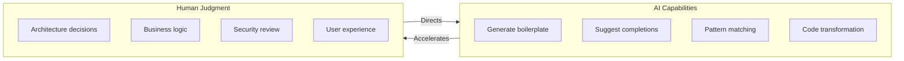
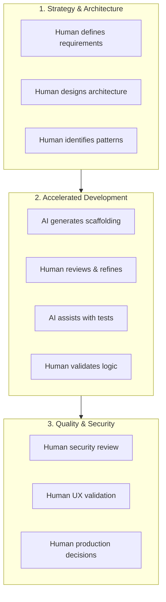
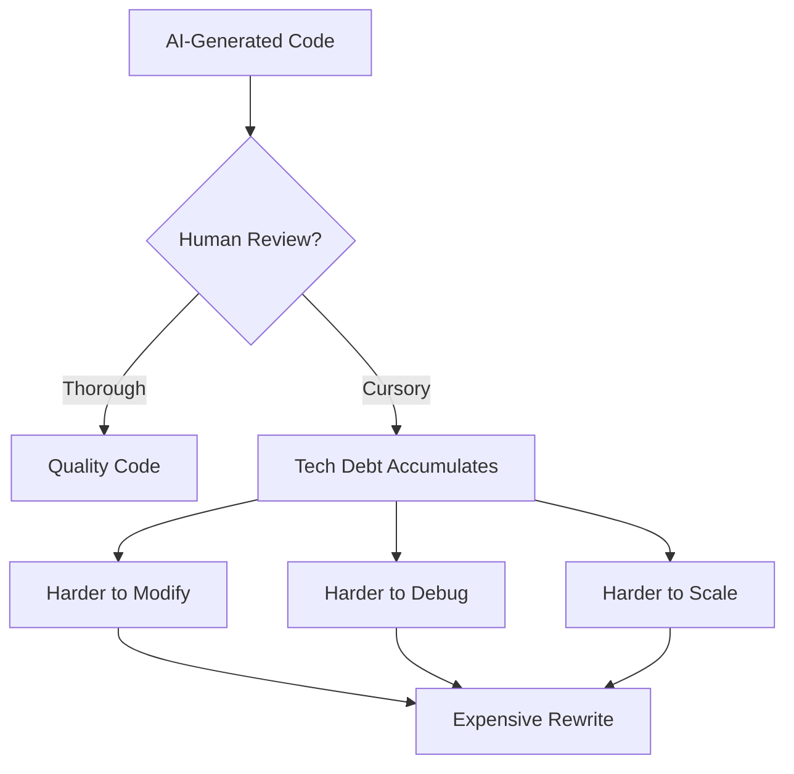
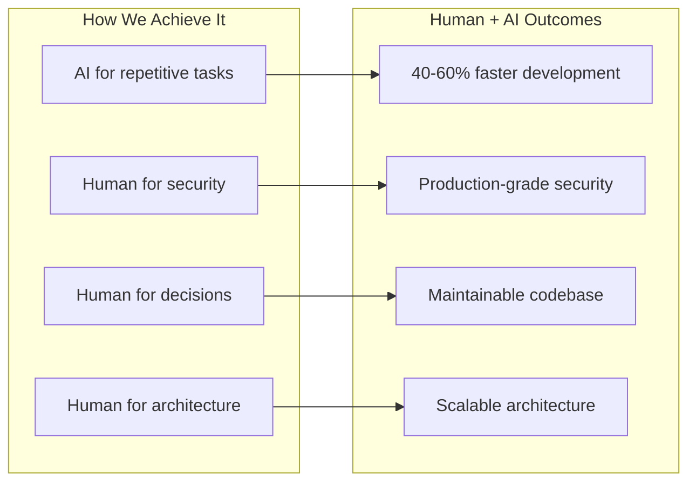

# The AI-Augmented Development Model: Why Human-Led Teams Still Win

## How senior engineers use AI to deliver faster without sacrificing quality—and why "AI-powered" development alone isn't enough.

Every week, another startup announces they're using AI to build software "10x faster." And every month, we see the aftermath: codebases that nobody can maintain, security vulnerabilities that slipped through, and products that technically work but fail in production.

The promise of AI in software development is real. But the execution matters more than the tooling.

At StartupVision, we've built over 50 AI-driven SaaS products and 180+ MVPs. We've seen what works and what doesn't. The answer isn't "use more AI" or "use less AI." It's understanding what AI is actually good at—and what still requires human judgment.

---

## The Problem with "AI-Powered" Development

Let's be direct: AI coding assistants are remarkable. They can generate boilerplate code in seconds, suggest implementations, and handle repetitive tasks that used to consume hours.

But here's what they can't do:

**Understand your business context.** AI doesn't know that your healthcare client needs HIPAA compliance, or that your fintech product will face SOC 2 audits. It generates code that works syntactically but may fail regulatory scrutiny.

**Make architectural decisions.** Should you use a microservices architecture or a monolith? Event-driven or request-response? These decisions compound over years—and AI optimizes for the immediate problem, not the long-term trajectory.

**Catch the subtle bugs.** AI-generated code often "looks right" but contains edge cases that only experienced engineers recognize. The code compiles. The tests pass. And then it fails at 2 AM when real users hit unexpected paths.

> "AI gives you an answer; senior engineers understand which answer fits your specific situation."

**Navigate trade-offs.** Every technical decision involves trade-offs. Speed vs. maintainability. Flexibility vs. simplicity. AI provides options; humans decide which option serves the business.

---

## The AI-Augmented Model

Our approach is different. We call it AI-augmented development: human-led teams using AI as a force multiplier, not a replacement.

The partnership model works in three phases:

Here's how it works in practice:

### 1. Senior Engineers Lead Every Decision

Every architectural choice, technology selection, and design pattern comes from engineers with 20+ years of experience. They've seen what scales and what breaks. They've built products that got acquired and products that failed. That pattern recognition isn't something you can prompt into existence.

### 2. AI Handles the Implementation Details

Once the architecture is set, AI accelerates execution. Our engineers use AI to:

- Generate boilerplate and scaffolding
- Implement well-defined functions from clear specifications
- Write initial test cases
- Refactor repetitive patterns
- Document code as it's written

This isn't about replacing thinking—it's about eliminating the mechanical work so engineers can focus on the parts that matter.

### 3. Human Review at Every Stage

Every piece of AI-generated code goes through human review. Not a quick glance—a genuine code review asking:

- Does this align with our architecture?
- Are there security implications?
- Will this scale under load?
- Is this maintainable by future developers?

> "This is where we catch the 20% of AI suggestions that look correct but aren't. That 20% is the difference between a product that works and a product that works in production."

### 4. Compliance Built In, Not Bolted On

For our enterprise clients, compliance isn't optional. We build with SOC 2, HIPAA, GDPR, and accessibility requirements in mind from day one. AI doesn't understand compliance—but our engineers do, and they ensure every component meets the relevant standards.

---

## The Speed Advantage Is Real

Does AI-augmented development actually deliver faster?

Yes—but not in the way most people expect.

The speed comes from:

- **Fewer rewrites.** Getting the architecture right the first time means less refactoring later.
- **Less debugging.** Human review catches issues before they become production incidents.
- **Faster iteration.** AI handles the mechanical work, so engineers can respond to feedback quickly.
- **No compliance retrofits.** Building it right means you don't spend months "making it compliant" before enterprise sales.

We've taken products from concept to launch in 6-8 weeks. Not by cutting corners, but by eliminating the waste that slows traditional development down.

---

## When AI-Only Approaches Fail

The results of human-directed, AI-accelerated development:

We regularly work with founders who come to us after trying AI-first development platforms. The pattern is consistent:

**The prototype worked great.** AI tools are excellent at generating demos that look impressive. They can create a working interface in hours.

**Production exposed the problems.** Real users revealed edge cases. The database didn't scale. The authentication had vulnerabilities. The payment integration failed under load.

**The codebase became unmaintainable.** Without architectural discipline, AI-generated code becomes a tangled mess. Each new feature makes things worse.

**The retrofit costs more than starting over.** By the time they find us, rebuilding from scratch is often cheaper than fixing what exists.

This isn't a criticism of AI tools—they're transformative for the right use cases. But without experienced engineers directing them, the output optimizes for the wrong goals.

---

## What This Means for Your Product

If you're building a prototype to test an idea, AI-first tools might be exactly right. Speed matters, and you're not committing to the architecture long-term.

If you're building something that needs to scale, handle real users, meet compliance requirements, or support a business for years—you need human-led development.

> "The question isn't 'AI or no AI.' It's 'who's making the decisions?'"

---

## The StartupVision Approach

We've refined this model across 50+ products and 180+ MVPs. Our team—senior engineers with an average of 20+ years experience—uses AI to amplify their capabilities, not replace their judgment.

The result: enterprise-quality products delivered at startup speed.

If you're evaluating how to build your product, we'd welcome the conversation. Not every product needs our level of involvement—but understanding the trade-offs helps you make the right choice for your specific situation.

---

*StartupVision partners with founders to build, scale, and lead technology organizations. Learn more at [startupvision.net](https://startupvision.net).*

---

**Tags:** Artificial Intelligence, Software Development, Startup, Technology, Product Development, Engineering, AI Tools, Code Quality
