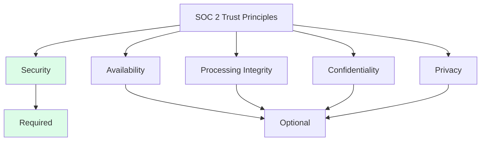
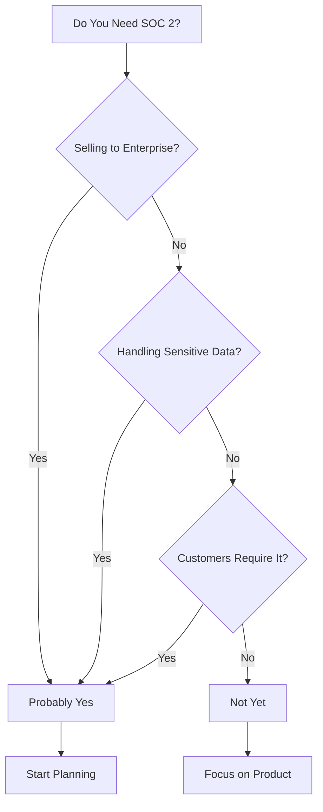
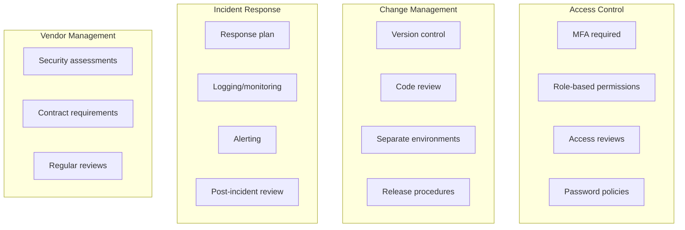
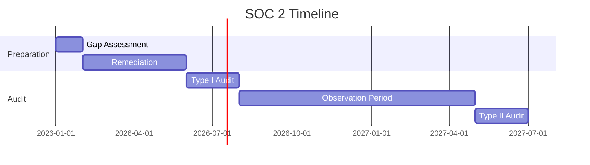
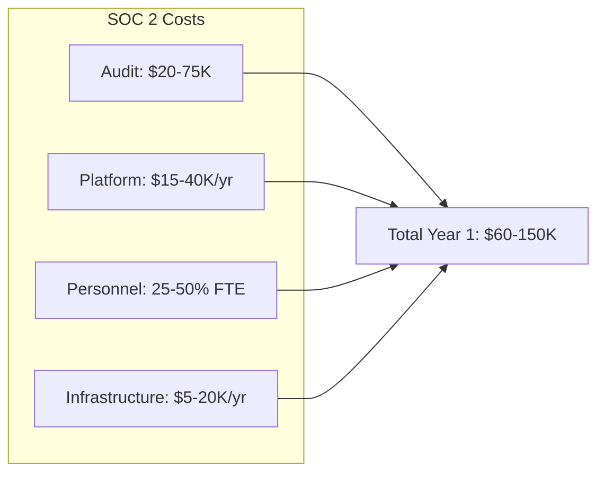
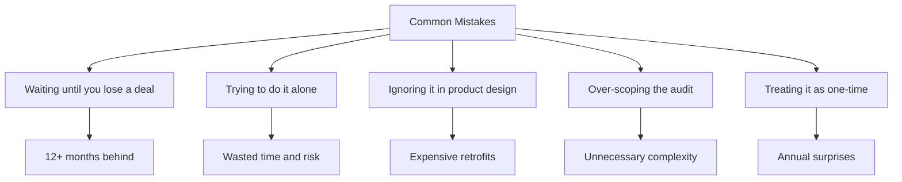

# SOC 2 Compliance for Startups: A No-BS Guide

## What it actually takes, what it costs, and whether you need it yet.

You're trying to close an enterprise deal. Everything's going well until procurement sends the security questionnaire. One question changes everything:

"Please provide your SOC 2 Type II report."

You don't have one. Now you need to understand what SOC 2 is, whether you need it, and how long it takes to get. Let's cut through the confusion.

---

## What SOC 2 Actually Is

SOC 2 is a security and operational audit designed by the American Institute of CPAs (AICPA). It evaluates how well you protect customer data across five areas:

- **Security:** Protection against unauthorized access
- **Availability:** System uptime and accessibility
- **Processing Integrity:** Accurate and complete data processing
- **Confidentiality:** Protection of sensitive information
- **Privacy:** Handling of personal information

Most companies focus on Security, the mandatory component, and add others based on customer needs.

> "Type I is a point-in-time assessment. Type II proves you maintained controls over 6-12 months. Enterprise customers want Type II."

---

## Do You Actually Need It?

Do you need SOC 2?

**Yes, if:**
- You're selling to enterprise customers (Fortune 500, government, regulated industries)
- You're handling sensitive data (financial, health, personal information)
- Your customers' compliance depends on your compliance
- You're in a competitive market where SOC 2 is expected

**Not yet, if:**
- You're selling to SMBs who don't require it
- You're pre-product-market fit (focus on the product first)
- Your customers haven't asked (but verify this with sales)
- You have fewer than 10 employees and minimal data handling

The honest answer: if you're not sure, ask your potential customers. A security questionnaire rejection is a clear signal.

---

## What It Actually Takes

### The Controls

SOC 2 doesn't prescribe specific technologies. It defines control objectives you must meet:

**Access Control:**
- Multi-factor authentication
- Role-based permissions
- Access reviews and deprovisioning
- Password policies

**Change Management:**
- Version control for code
- Code review processes
- Separation of development and production
- Documented release procedures

**Incident Response:**
- Defined incident response plan
- Logging and monitoring
- Alerting mechanisms
- Post-incident reviews

**Vendor Management:**
- Third-party security assessments
- Contracts with security requirements
- Regular vendor reviews

**Employee Security:**
- Background checks
- Security training
- Acceptable use policies
- Offboarding procedures

---

### The Process

SOC 2 control areas:

SOC 2 timeline:

SOC 2 costs breakdown:

1. **Gap Assessment (2-4 weeks):** Evaluate your current state against SOC 2 requirements. Identify what's missing.

2. **Remediation (2-6 months):** Implement the missing controls. This is where most time goes.

3. **Type I Audit (1-2 months):** An auditor evaluates your controls at a point in time.

4. **Observation Period (6-12 months):** For Type II, you operate with controls in place while collecting evidence.

5. **Type II Audit (1-2 months):** Auditor reviews the observation period and issues the report.

> "Total timeline for first Type II: 12-18 months if you're starting from scratch."

---

### The Costs

**Audit costs:**
- Type I: $20,000-50,000
- Type II: $30,000-75,000
- Annual Type II renewal: $25,000-60,000

**Compliance platform (optional but recommended):**
- Vanta, Drata, Secureframe: $15,000-40,000/year
- These automate evidence collection and reduce audit prep time significantly

**Personnel time:**
- Someone needs to own this. For startups, it's often 25-50% of a person's time during implementation.

**Infrastructure changes:**
- Logging, monitoring, and security tools: $5,000-20,000/year

> "Total first-year cost for a startup: $60,000-150,000 including platform, audit, and infrastructure."

---

## The Startup Approach

Enterprise companies spend 18 months and half a million dollars on SOC 2. Startups can't afford that. Here's how to do it efficiently:

### Start with Compliance in Mind

The cheapest SOC 2 is the one built into your practices from day one. If you're starting a new product:

- Use MFA from the beginning
- Implement proper logging early
- Document your processes as you create them
- Choose vendors that are already SOC 2 compliant

> "Retrofitting is expensive. Building it in is not."

### Use a Compliance Platform

Vanta, Drata, and Secureframe aren't cheap, but they're worth it. They:
- Continuously monitor your controls
- Auto-collect evidence for auditors
- Reduce audit prep from months to weeks
- Guide you on what's required

### Be Strategic About Scope

SOC 2 audits scope matters. You're auditing specific systems, not your whole company. Consider:
- Which systems actually handle customer data?
- Can you limit scope to reduce complexity?
- What's the minimum that satisfies customer requirements?

Smaller scope = faster audit = lower cost.

---

## Common Mistakes

Common SOC 2 mistakes:

**Waiting until you lose a deal.** SOC 2 takes 12+ months. If you wait until you need it, you're a year behind.

**Trying to do it alone.** Compliance platforms and consultants cost money, but they save time and reduce risk.

**Ignoring it in product design.** Adding logging, access controls, and audit trails later is expensive. Build them in.

**Over-scoping.** You don't need to audit every system. Focus on what matters for your customers.

**Treating it as one-time.** SOC 2 is annual. Build sustainable practices, not temporary fixes.

---

## The Bottom Line

SOC 2 is a cost of doing enterprise business. It's not optional if your customers require it. But it's also not as scary as it sounds.

The key is starting early—even before you need it. Build compliance into your practices. Use modern tools to automate what can be automated. And recognize that the investment pays off in deals you'll close that you couldn't otherwise.

> "If enterprise customers are in your future, SOC 2 should be in your roadmap. The question isn't if—it's when to start."

---

*StartupVision builds compliance-first from day one. Our team has deep expertise in SOC 2, HIPAA, GDPR, and enterprise security requirements. Learn more at [startupvision.net](https://startupvision.net).*

---

**Tags:** SOC 2, Compliance, Startup Security, Enterprise Sales, Information Security, Cybersecurity, Startup, B2B
