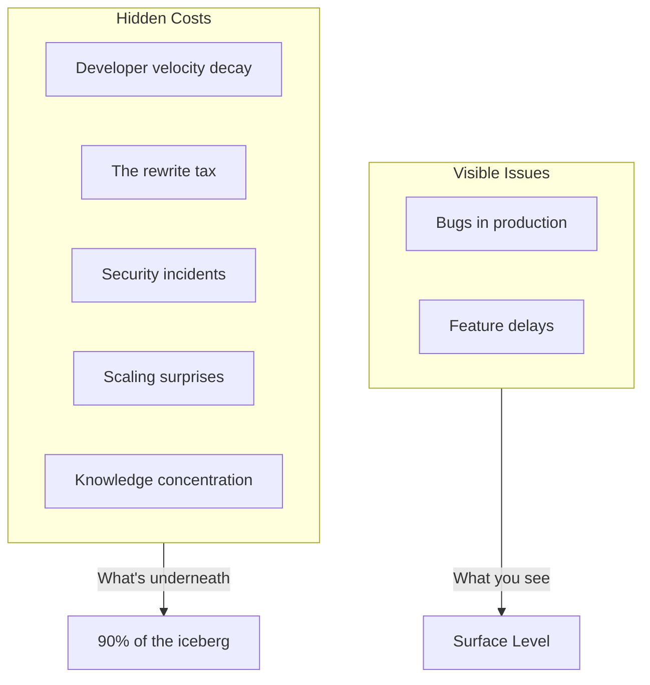
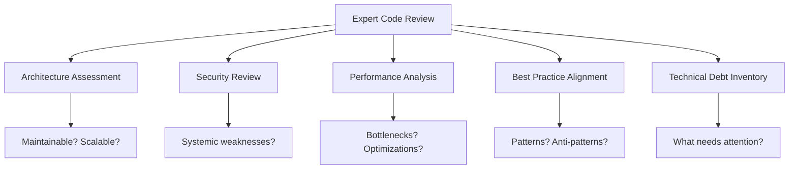
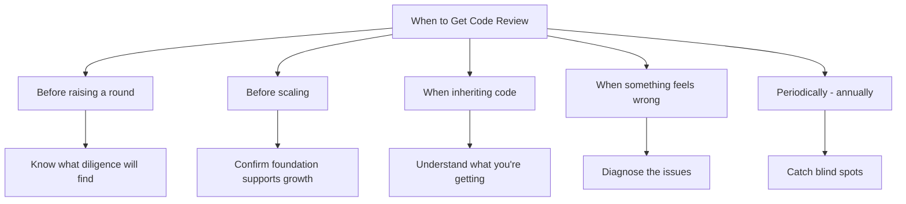
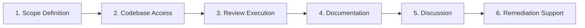
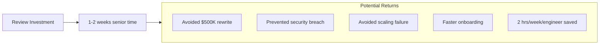

# The ROI of Expert Code Review

## Why external code review pays for itself—and the hidden costs of skipping it.

Your codebase is an asset. It's also a liability.

Every line of code is a future maintenance cost, a potential security vulnerability, and a decision someone will need to understand. The difference between a codebase that accelerates your business and one that drags it down often comes down to whether someone with experience has looked at it critically.

External code review isn't about catching bugs—your tests should do that. It's about catching the decisions that become expensive problems.

---

## The Hidden Costs of Code Quality Debt

The hidden costs of code quality debt:

### Cost 1: Developer Velocity Decay

New features that should take a week start taking a month. Simple changes require understanding tangled dependencies. Onboarding new engineers takes three months instead of three weeks.

> "This decay is gradual. By the time you notice, you've lost months of cumulative productivity."

### Cost 2: The Rewrite Tax

Eventually, the codebase becomes untenable. The rewrite conversation starts. "If we'd just started with a better architecture..."

Rewrites are expensive—not just in engineering time, but in opportunity cost. Every month spent rewriting is a month not spent on new features, sales, or growth.

### Cost 3: Security Incidents

Security vulnerabilities in code compound. An insecure authentication flow built in month one is still there in month twelve, with twelve months of user data exposed.

The cost of a breach isn't just technical—it's reputational, legal, and sometimes existential.

### Cost 4: Scaling Surprises

The database query that worked at 100 users becomes a bottleneck at 10,000. The architecture that handled MVP load collapses under growth.

> "Scaling problems discovered in production are expensive. Scaling problems discovered in review are cheap."

### Cost 5: Knowledge Concentration

When only the original developer understands the code, that person becomes a single point of failure. They can't go on vacation. They can't leave. The company becomes hostage to an individual.

Good code can be understood by someone who didn't write it. That's the test.

---

## What Expert Code Review Actually Provides

What expert code review provides:

### Architecture Assessment

Is the system structured for maintainability? Are the boundaries sensible? Will this architecture scale with the team and the product?

These questions are hard to answer from inside a codebase. Fresh, experienced eyes see patterns and problems that familiarity obscures.

### Security Review

Authentication, authorization, data handling, input validation, dependency vulnerabilities—security requires specialized attention.

A security-focused review isn't about finding every bug. It's about identifying systemic weaknesses that could become breaches.

### Performance Analysis

Where are the potential bottlenecks? What will break under load? Are there obvious optimizations being missed?

Performance problems are easier to prevent than to fix. Review catches them early.

### Best Practice Alignment

Are you following established patterns for your stack? Are there common mistakes being repeated? Is the code consistent enough to maintain?

> "Experience recognizes anti-patterns that inexperience doesn't even see as patterns."

### Technical Debt Inventory

What corners were cut? What will need attention? What's the prioritized list of improvements?

Knowing your debt is the first step to managing it. Review creates the inventory.

---

## When Code Review Makes Sense

### Before a Major Investment

Raising a round? The code will be diligenced. Better to know what they'll find—and fix the critical issues—before they look.

### Before Scaling

About to 10x your users? 5x your team? Confirm the foundation supports what's coming.

### When Inheriting Code

Acquiring a company? Contracting development? Before you take ownership, understand what you're getting.

### When Something Feels Wrong

Development is slow. Bugs are recurring. Engineers are frustrated. The symptoms are clear; the causes aren't. Review diagnoses the issues.

### Periodically

Even well-run teams benefit from external perspective annually. Internal reviews catch issues; external reviews catch blind spots.

---

## The Review Process

When code review makes sense:

The review process:

Measuring ROI:

1. **Scope Definition** — What systems are in scope? What questions need answering?

2. **Codebase Access** — Read-only access to repositories, documentation, and ideally the ability to run the system locally.

3. **Review Execution** — Experienced engineers review the code against defined criteria.

4. **Documentation** — Findings documented with severity, impact, and recommended remediation.

5. **Discussion** — Walkthrough with your team. Context sharing. Prioritization.

6. **Optional: Remediation Support** — Many teams want help fixing issues, not just finding them.

---

## Measuring ROI

Code review ROI comes from avoided costs and accelerated outcomes:

> "The investment in review is typically 1-2 weeks of senior engineer time. The return is measured in months of team time, avoided disasters, and accelerated growth."

**Avoided rewrite cost:** If review prevents a $500K rewrite, that's the value.

**Avoided security incident:** If review prevents a breach, the value is potentially existential.

**Avoided scaling failure:** If review prevents a production outage during your biggest sales moment, that's quantifiable.

**Accelerated hiring:** If review improves code quality enough to reduce onboarding time, multiply that by engineering cost.

**Faster development:** If review leads to improvements that save each engineer 2 hours per week, the cumulative value is significant.

---

## What Makes Review Valuable

Not all reviews are equal. Valuable review comes from:

**Experience.** Reviewers need to have seen both good and bad. Pattern recognition requires exposure to patterns.

**Relevant expertise.** A React specialist reviewing a Go backend provides limited value. Match expertise to stack.

**Business context understanding.** Technical recommendations without business context miss the point.

**Actionable output.** Findings without remediation paths are frustrating. Good review tells you what to do.

---

## The Bottom Line

Your codebase is either an asset or a liability. Often, it's both—assets in some areas, liabilities in others. Code review tells you which is which.

> "The cost of review is predictable and contained. The cost of skipping review is unknown and potentially catastrophic."

If your codebase is important to your business—and if you're reading this, it probably is—external review isn't an expense. It's risk management.

---

*StartupVision provides expert code review as part of our service offerings. Our senior engineers have collectively reviewed hundreds of codebases across every major stack. Learn more at [startupvision.net](https://startupvision.net).*

---

**Tags:** Code Review, Technical Debt, Software Quality, Software Engineering, Security Review, Startup, Code Quality, Engineering
