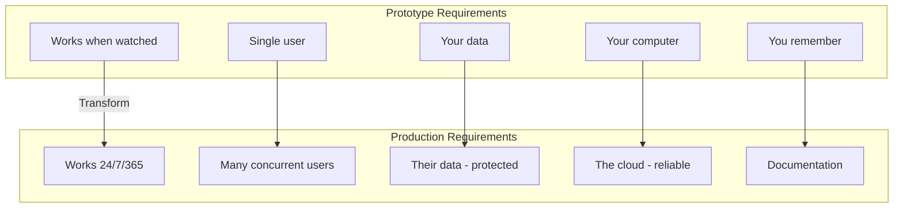
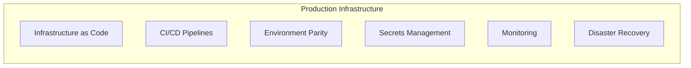
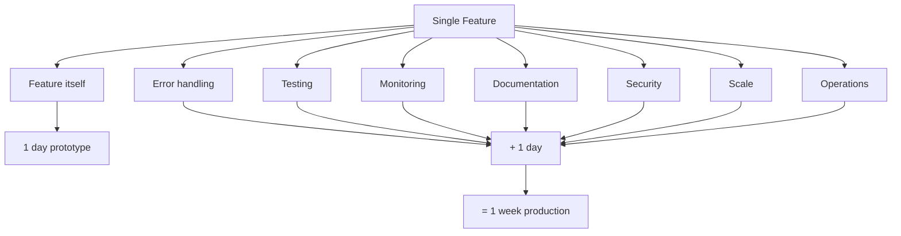
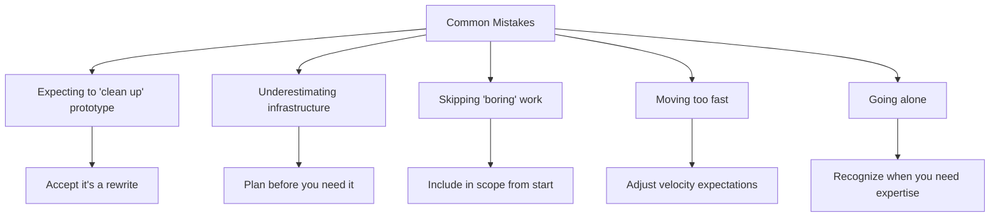
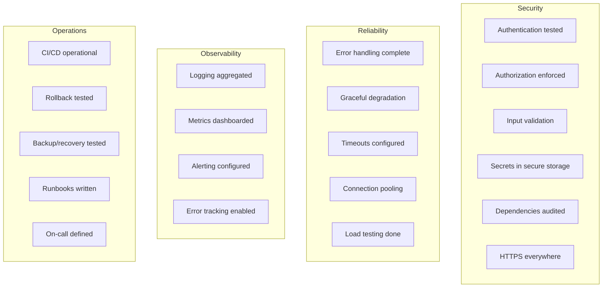

# From Prototype to Production: What Actually Changes

## The 10x complexity increase nobody talks about—and how to navigate it.

Your prototype works. Users love the demo. Investors are impressed. The product vision is validated.

Now you need to make it real.

The transition from prototype to production is where most products either mature into businesses or die trying. It's not a linear progression—it's a fundamental transformation.

---

## What Changes (Everything)

### From "Works" to "Works Every Time"

A prototype needs to work when you're watching. A production system needs to work at 3 AM when nobody's watching and a user in Singapore is having the worst day of their life.

What changes from prototype to production:

**What this requires:**
- Error handling for every conceivable failure
- Graceful degradation when dependencies fail
- Logging that tells you what happened
- Alerting that wakes the right person up
- Runbooks for common issues

> "The prototype path: 'Let's see if this works.' The production mindset: 'What happens when this doesn't work?'"

---

### From "One User" to "Many Users"

Prototypes serve demos. Production serves concurrent load from users with different data, different browsers, different network conditions, and different expectations.

**What this requires:**
- Database optimization (indexes, query planning, connection pooling)
- Caching strategies
- Rate limiting
- Load testing
- Capacity planning
- CDN configuration

The performance that felt fine with test data collapses under real usage.

---

### From "Your Data" to "Their Data"

Prototype data is fake. Production data is real—often sensitive, always valuable, sometimes regulated.

**What this requires:**
- Authentication that's actually secure
- Authorization that's correctly implemented
- Encryption at rest and in transit
- Backup and recovery procedures
- Data retention and deletion policies
- Compliance with applicable regulations

> "Security retrofits are expensive. Security from the start is not."

---

### From "Your Computer" to "The Cloud"

Prototypes run locally or on simple hosting. Production runs on infrastructure that needs to be reliable, scalable, and maintainable.

Production infrastructure requirements:

The complexity multiplier:

**What this requires:**
- Infrastructure as code
- CI/CD pipelines
- Environment parity (dev, staging, production)
- Secrets management
- Monitoring and observability
- Disaster recovery planning

---

### From "You Remember" to "Documentation"

You know why every decision was made because you just made them. In six months, you won't remember. Neither will anyone else.

**What this requires:**
- Technical documentation
- API documentation
- Runbooks and playbooks
- Architecture decision records
- Onboarding materials

> "The knowledge in your head needs to become knowledge in systems."

---

## The Complexity Multiplier

Why does this feel like 10x the work?

Because every feature now has multiple dimensions:

- The feature itself (what prototype had)
- Error handling (what happens when it fails)
- Testing (how we know it works)
- Monitoring (how we know it's working)
- Documentation (how someone else learns it)
- Security (how we prevent misuse)
- Scale (how it performs under load)
- Operations (how we deploy and maintain it)

Each dimension multiplies the work. A feature that took a day to prototype takes a week to productionize. That's not failure—that's the nature of production software.

---

## The Common Mistakes

Common prototype-to-production mistakes:

The production checklist:

### Mistake 1: Expecting to "Clean Up" the Prototype

The prototype was built to demonstrate, not to endure. The architecture, the patterns, the shortcuts—they were appropriate for their purpose.

**The fix:** Accept that production is a rewrite, not a cleanup. Keep the learning; rebuild the implementation.

### Mistake 2: Underestimating Infrastructure

"We'll just deploy it and see what happens."

**The fix:** Plan infrastructure before you need it. CI/CD, monitoring, and environment management aren't luxuries—they're prerequisites.

### Mistake 3: Skipping the "Boring" Work

Security, documentation, testing—they don't feel like progress. But they're what separates a demo from a business.

**The fix:** Include production requirements in the scope from the beginning. If the timeline doesn't account for them, the timeline is wrong.

### Mistake 4: Moving Too Fast

Startup culture celebrates speed. But the speed that's right for prototyping isn't right for production.

**The fix:** Adjust velocity expectations. Production takes longer per feature. That's not slow—that's thorough.

### Mistake 5: Going Alone

The skills that built a great prototype aren't always the skills that build great production systems.

**The fix:** Recognize when you need different expertise. Senior engineers who've done production before accelerate the transition.

---

## The Production Checklist

Before you go live, verify:

**Security:**
- [ ] Authentication implemented and tested
- [ ] Authorization correctly enforced
- [ ] Input validation on all endpoints
- [ ] Secrets in secure storage (not code)
- [ ] Dependencies audited for vulnerabilities
- [ ] HTTPS everywhere

**Reliability:**
- [ ] Error handling for all failure modes
- [ ] Graceful degradation implemented
- [ ] Timeouts and retries configured
- [ ] Database connections pooled and limited
- [ ] Load testing completed

**Observability:**
- [ ] Logging implemented and aggregated
- [ ] Metrics collected and dashboarded
- [ ] Alerting configured
- [ ] Error tracking enabled

**Operations:**
- [ ] CI/CD pipeline operational
- [ ] Deployment rollback tested
- [ ] Backup and recovery tested
- [ ] Runbooks for common issues
- [ ] On-call rotation defined

---

## The Right Approach

> "Start with the end in mind. Know you're building for production, even during prototype."

**Build foundation first.** Infrastructure, CI/CD, monitoring—set these up before feature development.

**Invest in security early.** Security retrofits are expensive and error-prone. Build it in.

**Test continuously.** Automated testing catches regressions before production does.

**Document as you go.** Documentation written during development is accurate. Documentation written after is incomplete.

**Get help if needed.** The transition is a specific skill set. Bringing in experience accelerates the timeline and improves the outcome.

---

## The Bottom Line

The prototype proved the idea. Production proves the business.

The complexity increase isn't a bug—it's the nature of building something real. Products that skip production requirements fail in production. Products that embrace them succeed.

If you're looking at a prototype and planning production, budget for the full transformation. The features are just the beginning.

---

*StartupVision takes products from prototype to production. Our team has made this transition over 180 times. We know where the complexity hides—and how to navigate it. Learn more at [startupvision.net](https://startupvision.net).*

---

**Tags:** Product Development, Prototype, Production, Software Engineering, MVP, Startup, Scaling, DevOps
