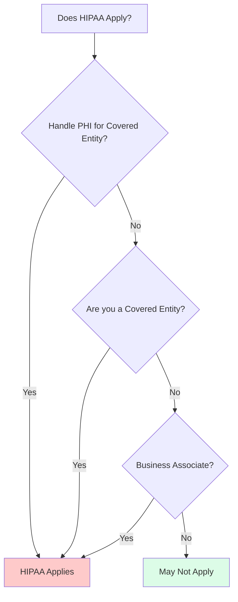
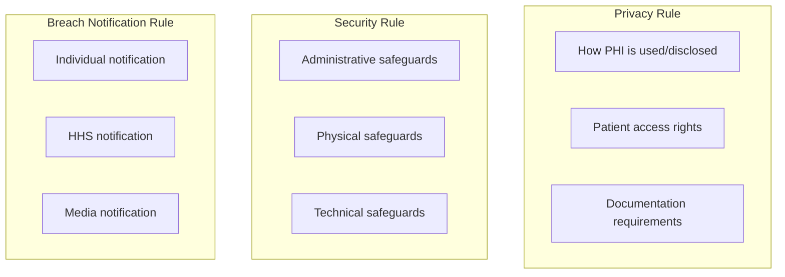
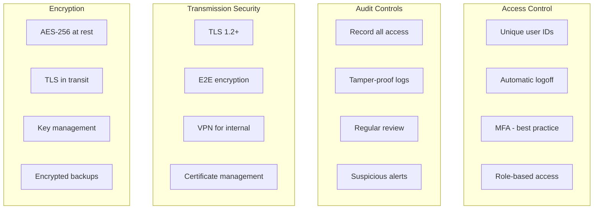
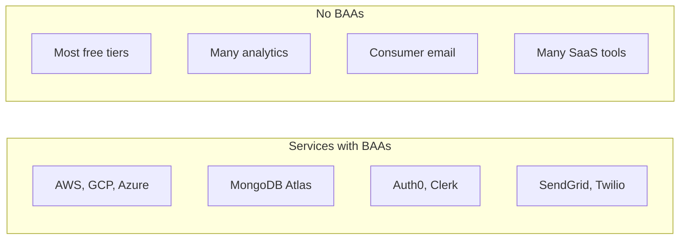
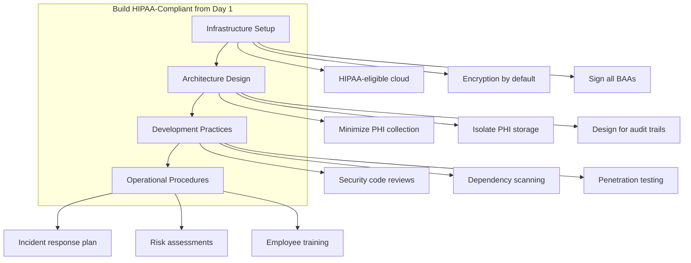
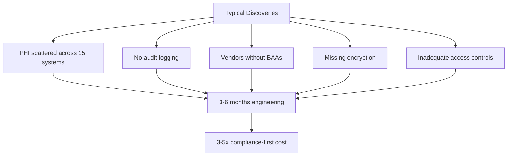

# HIPAA Compliance for Health Tech Startups

## Why building compliant from day one beats the expensive retrofit—and how to do it right.

You're building health tech. That means you're building on HIPAA ground.

HIPAA (Health Insurance Portability and Accountability Act) isn't optional for products that handle Protected Health Information (PHI). Violations aren't just fines—they're reputational damage, criminal liability, and potentially the end of your company.

But here's what most founders don't realize: building HIPAA-compliant from the start isn't significantly harder than building non-compliant. The retrofit, however, is brutal.

---

## Does HIPAA Apply to You?

Does HIPAA apply to you?

The three HIPAA rules:

**HIPAA applies if you:**
- Handle PHI on behalf of a Covered Entity (hospitals, clinics, insurers, pharmacies)
- Are a Covered Entity yourself
- Are a Business Associate of a Covered Entity

**PHI includes:**
- Names, addresses, dates (except year), phone numbers, emails
- Medical record numbers, health plan numbers, SSNs
- Biometric data, photos, any unique identifier
- Any data that can identify an individual AND relates to their health

**If you're building:**
- Patient portals
- Telehealth platforms
- Healthcare scheduling
- Medical records access
- Health tracking apps that integrate with providers
- Insurance or billing systems

HIPAA almost certainly applies.

---

## The Three Rules You Need to Know

### The Privacy Rule

Controls how PHI is used and disclosed.

**Key requirements:**
- Only collect PHI you need
- Only use PHI for purposes disclosed to the patient
- Allow patients to access and correct their records
- Document all disclosures
- Train employees on privacy policies

### The Security Rule

Specifies how to protect electronic PHI (ePHI).

**Key requirements:**
- Administrative safeguards (policies, training, risk assessment)
- Physical safeguards (facility access, workstation security)
- Technical safeguards (access control, encryption, audit logs)

### The Breach Notification Rule

Specifies what happens if PHI is exposed.

**Key requirements:**
- Notify affected individuals within 60 days
- Notify HHS (immediately for breaches over 500 individuals)
- Notify media for breaches over 500 in a state
- Document all breaches and response actions

---

## The Technical Requirements

Technical requirements for HIPAA:

Services with and without BAAs:

### Access Control

**Required:**
- Unique user identification
- Automatic logoff
- Encryption and decryption capability

**Best practices:**
- Multi-factor authentication
- Role-based access control
- Principle of least privilege
- Regular access reviews

### Audit Controls

**Required:**
- Mechanisms to record and examine access to ePHI

**Best practices:**
- Comprehensive logging of all data access
- Tamper-proof log storage
- Regular log review
- Alerting on suspicious patterns

### Transmission Security

**Required:**
- Protect ePHI during electronic transmission

**Best practices:**
- TLS 1.2+ for all transmissions
- End-to-end encryption for sensitive flows
- VPN for internal access
- Certificate management

### Encryption

**Addressable (strongly recommended):**
- Encrypt ePHI at rest and in transit

**Best practices:**
- AES-256 for data at rest
- TLS 1.2+ for data in transit
- Key management procedures
- Encryption for backups

---

## The Business Associate Agreement (BAA)

If you're handling PHI for a Covered Entity, you need a BAA. This contract:
- Defines permitted uses of PHI
- Requires you to implement safeguards
- Makes you liable for breaches
- Allows for audits and inspections

> "Your vendors also need BAAs. Every third party that handles PHI—cloud providers, analytics services, email providers—needs a BAA with you. No BAA means you're violating HIPAA."

**Services that offer BAAs:**
- AWS, GCP, Azure
- MongoDB Atlas, some PostgreSQL hosts
- Auth0, Clerk
- SendGrid, Twilio (for specific products)
- Many monitoring tools (check carefully)

**Services that don't:**
- Most free tiers
- Many analytics platforms
- Most consumer email services
- Many SaaS tools

Vet every vendor before using them with PHI.

---

## The Compliance-First Approach

The compliance-first approach:

The retrofit nightmare:

Building HIPAA-compliant from day one:

### 1. Infrastructure Setup
- Choose HIPAA-eligible cloud regions
- Enable encryption by default
- Configure compliant logging
- Sign BAAs with all vendors

### 2. Architecture Design
- Minimize PHI collection
- Isolate PHI in dedicated storage
- Design for access logging
- Plan for audit trails

### 3. Development Practices
- Security code reviews
- Dependency scanning
- Penetration testing
- Input validation everywhere

### 4. Operational Procedures
- Incident response plan
- Breach notification procedures
- Regular risk assessments
- Employee training

> "Compliance-first adds maybe 15-20% to initial development. The ROI is immediate in avoided retrofits, accelerated sales, and reduced risk."

---

## The Retrofit Nightmare

Building first, complying later:

### Typical discoveries:
- PHI scattered across 15 systems
- No audit logging (requires re-architecture)
- Vendors without BAAs (requires migration)
- Encryption missing at rest (requires data migration)
- Access controls inadequate (requires rework)

### Typical costs:
- 3-6 months of engineering time
- Significant infrastructure changes
- Potential data migration
- Delayed sales during compliance work
- Legal review of past practices

> "The retrofit typically costs 3-5x what compliance-first would have cost. And it delays your market entry while you fix it."

---

## The Compliance Toolkit

### Documentation
- Written policies for all HIPAA requirements
- Risk assessment documentation
- Training records
- BAAs with all vendors
- Breach response procedures

### Technical Controls
- Encryption at rest and in transit
- Comprehensive audit logging
- Access control with MFA
- Secure authentication
- Automated vulnerability scanning

### Operational Procedures
- Regular risk assessments
- Employee training program
- Incident response drills
- Vendor management reviews
- Policy updates

### Assessments
- Annual security risk assessment
- Periodic penetration testing
- Compliance gap analysis
- Vendor compliance verification

---

## Getting Started

1. **Determine if HIPAA applies.** If you're handling health data that can identify individuals, it probably does.

2. **Choose HIPAA-eligible infrastructure.** AWS, GCP, and Azure all offer HIPAA-eligible services with BAAs.

3. **Sign BAAs with all vendors.** Before using any service with PHI, confirm they offer a BAA.

4. **Implement technical controls.** Encryption, access control, logging—build them in from the start.

5. **Document everything.** Policies, procedures, training—HIPAA requires documentation.

6. **Conduct a risk assessment.** Identify your risks and document how you address them.

7. **Train your team.** Everyone handling PHI needs to understand the requirements.

---

## The Bottom Line

HIPAA isn't the enemy—uncertainty about HIPAA is.

When you understand the requirements and build for them from the start, compliance becomes part of development rather than an obstacle to it. Your product is safer, your sales are smoother, and your risk is contained.

> "If you're building health tech, you're building for HIPAA. Embrace it early."

---

*StartupVision builds HIPAA-compliant products from day one. Our team has deep expertise in healthcare compliance and security requirements. Learn more at [startupvision.net](https://startupvision.net).*

---

**Tags:** HIPAA, Healthcare Technology, Health Tech, Compliance, Startup, Security, Data Privacy, Healthcare Software, PHI
