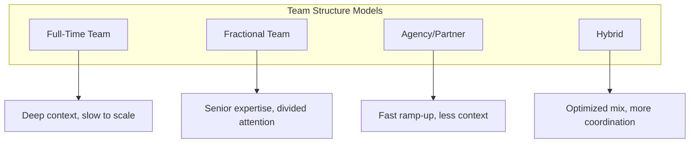
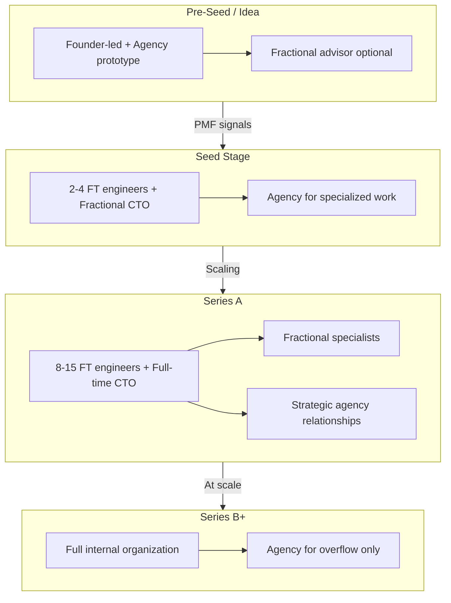
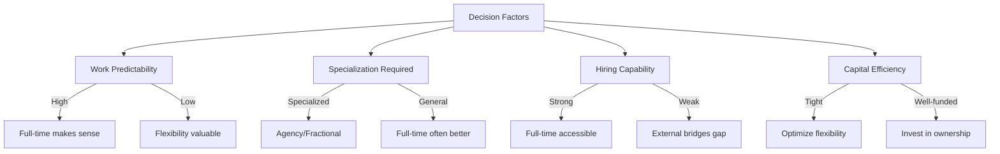
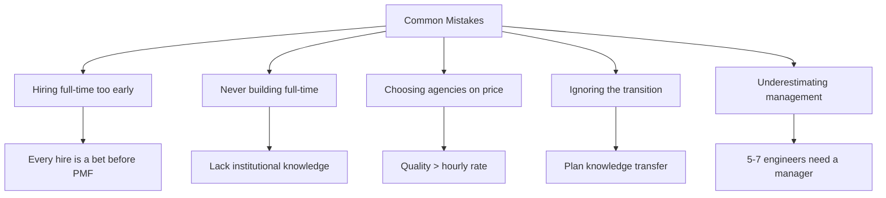

# Building Your Startup's Technical Team Strategy

## Full-time versus fractional versus agency versus hybrid—the team structures that actually work at each stage.

"Should I hire a full-time engineer or work with an agency?"

It's the wrong question—because the answer changes with your stage, your product, and your capabilities.

The right team structure for a pre-seed startup isn't right for a Series A company. What works when you're validating isn't what works when you're scaling.

Here's a framework for matching your team structure to your reality.

---

## The Four Models

The four team structure models:

### Model 1: Full-Time Team

You hire engineers as employees. They work exclusively on your product, integrate into your culture, and grow with the company.

**Strengths:**
- Deep context and commitment
- Cultural alignment
- Long-term knowledge retention
- Available for ad-hoc work
- Growing talent development capability

**Weaknesses:**
- Slow to scale up (hiring takes 3-6 months)
- Slow to scale down (severance, morale impact)
- Full compensation cost (salary, benefits, equity, management)
- Recruiting is a skill you may not have
- Limited experience diversity

---

### Model 2: Fractional Team

Part-time senior leaders (fractional CTO, CISO, CPO) who work across multiple companies. They provide expertise without full-time cost or commitment.

**Strengths:**
- Senior experience immediately
- Flexible engagement (10-20 hours/week)
- Broader perspective from multiple companies
- Lower cost than full-time equivalent
- Bridge to full-time hire

**Weaknesses:**
- Divided attention
- Not available for day-to-day decisions
- May not be available when you need surge capacity
- Relationship requires good communication

---

### Model 3: Agency/Partner Team

External companies build your product. You provide direction; they provide execution.

**Strengths:**
- Fast ramp-up (team ready immediately)
- Scalable capacity
- Diverse experience
- No recruiting burden
- Clear scope and deliverables

**Weaknesses:**
- Less context than full-time team
- Knowledge leaves when engagement ends
- Incentives may not fully align
- Quality varies significantly between agencies
- Premium pricing for flexibility

---

### Model 4: Hybrid

Combination of the above. Small full-time core, fractional leadership, agency for specific work.

**Strengths:**
- Optimizes for each function
- Flexibility with core stability
- Can grow into full-time over time
- Access to specialized expertise

**Weaknesses:**
- Coordination complexity
- Cultural fragmentation risk
- More relationships to manage
- Requires clear ownership boundaries

---

## The Stage-Appropriate Structure

Stage-appropriate team structures:

Decision factors:

### Pre-Seed / Idea Stage

**Recommended:** Founder-led with agency for prototype, possibly fractional advisor

**Why:** You're validating, not building for scale. Speed matters more than optimization. Don't commit to structure before you know what you're building.

> "No full-time engineers until you know what to build."

**What works:**
- Founder(s) setting direction
- Agency or platform for prototype/MVP
- Fractional CTO for occasional guidance

---

### Seed Stage

**Recommended:** Small full-time core (2-4 engineers) + fractional leadership + agency for surge

**Why:** You have product-market fit signals. You need committed people building the foundation. But you also need flexibility as priorities shift.

**What works:**
- 1 senior full-time engineer (or CTO) to own architecture
- 1-3 additional engineers for execution
- Fractional CTO if you don't have a full-time technical leader
- Agency for specialized work (mobile, ML, security audits)

---

### Series A

**Recommended:** Larger full-time team (8-15 engineers) + fractional specialists + strategic agency relationships

**Why:** You're scaling. You need dedicated teams. But you also need specialized expertise you can't yet justify full-time.

**What works:**
- Full-time VP Engineering or CTO
- Engineering teams organized around products/domains
- Fractional CISO if security is critical
- Agency for specialized builds (compliance tooling, integrations)

---

### Series B+

**Recommended:** Full-time as the default + agency for overflow and specialized work

**Why:** You're at scale. Culture and execution matter. Long-term knowledge matters. Full-time makes sense for core functions.

**What works:**
- Full internal engineering organization
- Agency only for well-defined projects or capacity overflow
- Fractional only for temporary needs (M&A diligence, special projects)

---

## The Decision Factors

### Factor 1: Predictability of Work

**High predictability → Full-time makes sense**
If you know what you're building for the next 12 months, full-time employees can plan and execute.

**Low predictability → Flexibility is valuable**
If you're pivoting, experimenting, or uncertain, paying for flexibility makes sense.

### Factor 2: Specialization Required

**Specialized skills → Consider agency/fractional**
ML engineers, security specialists, compliance experts—these skills are expensive full-time and may not be needed constantly.

**General engineering → Full-time is often better**
For your core product work, full-time engineers build context that compounds.

### Factor 3: Hiring Capability

**Strong hiring → Full-time is accessible**
If you can attract and evaluate talent, building your team makes sense.

**Weak hiring → Agency/fractional bridges the gap**
If hiring is slow or unsuccessful, external help lets you move while you improve recruiting.

### Factor 4: Capital Efficiency Requirements

**Tight capital → Optimize for flexibility**
Agencies and fractional let you pay for what you use. Full-time carries fixed costs.

**Well-funded → Invest in ownership**
Full-time teams build assets that compound. With capital, the investment makes sense.

---

## Common Mistakes

Common team structure mistakes:

### Mistake 1: Hiring Full-Time Too Early

Before product-market fit, every hire is a bet. If you pivot, that engineer may not be right for the new direction. Build flexibility into your early-stage structure.

### Mistake 2: Never Building Full-Time

At some point, you need core engineering ownership. Companies that stay agency-dependent too long lack the institutional knowledge to evolve their products.

### Mistake 3: Choosing Agencies on Price

> "The cheapest agency is rarely the best value. Quality, communication, and reliability matter more than hourly rates. A more expensive agency that delivers is cheaper than a bargain agency that doesn't."

### Mistake 4: Ignoring the Transition

The transition from agency-led to full-time-led is a specific challenge. Plan for knowledge transfer, documentation, and overlap. Don't just flip a switch.

### Mistake 5: Underestimating Management

Full-time employees need management. Every 5-7 engineers need a layer of management. That's time or people you need to budget for.

---

## The Honest Assessment

Ask yourself:

1. **What are we building in the next 6 months?** Is it defined enough to hire for?
2. **Can we recruit well?** Do we know how to find, evaluate, and close engineering talent?
3. **What do we truly need full-time?** What could be fractional or agency without loss?
4. **What's our capital situation?** How much flexibility do we need to maintain?
5. **Where are we weakest?** What capabilities are missing that we can't develop internally?

The answers point toward your structure.

---

## The Bottom Line

There's no universally right team structure—only the right structure for your stage, your product, and your capabilities.

> "Most successful companies evolve through multiple structures as they grow. The mistake is locking in too early or refusing to evolve when circumstances change."

Match your structure to your reality. Adjust as reality changes. That's the strategy.

---

*StartupVision works with founders at every stage, from agency development to fractional leadership to team building. We meet you where you are. Learn more at [startupvision.net](https://startupvision.net).*

---

**Tags:** Startup, Technical Team, Hiring, Engineering Team, Fractional CTO, Agency, Startup Strategy, Team Building, Engineering Management, Startup Growth
